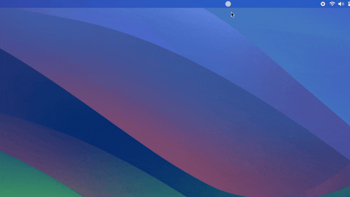

# Radial Timer

A minimalist macOS menu bar timer with an elegant radial progress indicator.

## Overview

Radial Timer lives in your menu bar, providing quick access to a countdown timer without cluttering your workspace. The menu bar icon itself serves as a visual indicator, displaying a radial progress animation that shrinks as time runs out.

## Features

- **Intuitive Controls** — Set your duration with a simple slider interface
- **Visual Feedback** — Menu bar icon displays remaining time at a glance
- **Audio Notification** — Plays a sound when the timer completes
- **Quick Toggle** — Option-click the menu bar icon to start/stop instantly
- **Native macOS Design** — Clean, modern interface that feels at home on macOS

## Technical Details

- Built with Swift and SwiftUI
- Native macOS application
- Lightweight menu bar utility
- No background services or excessive resource usage

## Download

Available in the [App Store](https://apps.apple.com/us/app/radial-timer/id6581479928?mt=12)

---

© 2025 Astere Software
